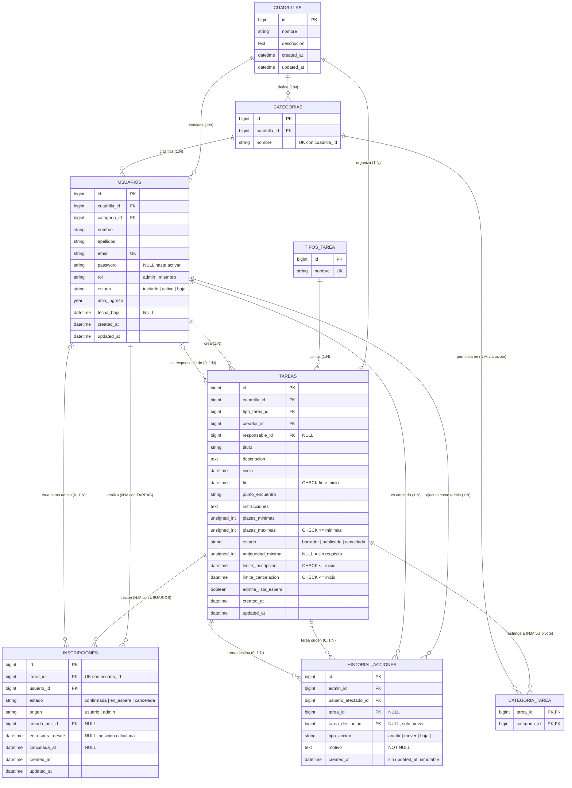

# Modelo Entidad-Relación (MVP)

Modelo de datos técnico que servirá de base para el desarrollo de las migraciones y el contrato de la API.

```mermaid
erDiagram
    CUADRILLAS ||--o{ USUARIOS : "contiene (1:N)"
    CUADRILLAS ||--o{ CATEGORIAS : "define (1:N)"
    CUADRILLAS ||--o{ TAREAS : "organiza (1:N)"
    CATEGORIAS ||--o{ USUARIOS : "clasifica (1:N)"
    TIPOS_TAREA ||--o{ TAREAS : "tipifica (1:N)"
    TAREAS ||--o{ CATEGORIA_TAREA : "restringe a (N:M via pivote)"
    CATEGORIAS ||--o{ CATEGORIA_TAREA : "permitida en (N:M via pivote)"
    USUARIOS ||--o{ INSCRIPCIONES : "realiza (N:M con TAREAS)"
    TAREAS ||--o{ INSCRIPCIONES : "recibe (N:M con USUARIOS)"
    USUARIOS ||--o{ TAREAS : "crea (1:N)"
    USUARIOS |o--o{ TAREAS : "es responsable de (0..1:N)"
    USUARIOS |o--o{ INSCRIPCIONES : "crea como admin (0..1:N)"
    USUARIOS ||--o{ HISTORIAL_ACCIONES : "ejecuta como admin (1:N)"
    USUARIOS ||--o{ HISTORIAL_ACCIONES : "es afectado (1:N)"
    TAREAS |o--o{ HISTORIAL_ACCIONES : "tarea origen (0..1:N)"
    TAREAS |o--o{ HISTORIAL_ACCIONES : "tarea destino (0..1:N)"

    CUADRILLAS {
        bigint id PK
        string nombre
        text descripcion
        datetime created_at
        datetime updated_at
    }

    CATEGORIAS {
        bigint id PK
        bigint cuadrilla_id FK
        string nombre "UK con cuadrilla_id"
    }

    USUARIOS {
        bigint id PK
        bigint cuadrilla_id FK
        bigint categoria_id FK
        string nombre
        string apellidos
        string email UK
        string password "NULL hasta activar"
        string rol "admin | miembro"
        string estado "invitado | activo | baja"
        year anio_ingreso
        datetime fecha_baja "NULL"
        datetime created_at
        datetime updated_at
    }

    TIPOS_TAREA {
        bigint id PK
        string nombre UK
    }

    TAREAS {
        bigint id PK
        bigint cuadrilla_id FK
        bigint tipo_tarea_id FK
        bigint creador_id FK
        bigint responsable_id FK "NULL"
        string titulo
        text descripcion
        datetime inicio
        datetime fin "CHECK fin > inicio"
        string punto_encuentro
        text instrucciones
        unsigned_int plazas_minimas
        unsigned_int plazas_maximas "CHECK >= minimas"
        string estado "borrador | publicada | cancelada"
        unsigned_int antiguedad_minima "NULL = sin requisito"
        datetime limite_inscripcion "CHECK <= inicio"
        datetime limite_cancelacion "CHECK <= inicio"
        boolean admite_lista_espera
        datetime created_at
        datetime updated_at
    }

    CATEGORIA_TAREA {
        bigint tarea_id PK, FK
        bigint categoria_id PK, FK
    }

    INSCRIPCIONES {
        bigint id PK
        bigint tarea_id FK "UK con usuario_id"
        bigint usuario_id FK
        string estado "confirmada | en_espera | cancelada"
        string origen "usuario | admin"
        bigint creada_por_id FK "NULL"
        datetime en_espera_desde "NULL; posicion calculada"
        datetime cancelada_at "NULL"
        datetime created_at
        datetime updated_at
    }

    HISTORIAL_ACCIONES {
        bigint id PK
        bigint admin_id FK
        bigint usuario_afectado_id FK
        bigint tarea_id FK "NULL"
        bigint tarea_destino_id FK "NULL, solo mover"
        string tipo_accion "anadir | mover | baja | ..."
        text motivo "NOT NULL"
        datetime created_at "sin updated_at: inmutable"
    }
```